# 🔗 GitHub Integration Setup

## 📋 Overview

**Architecture:**
```
GitHub (Code Storage) → Docker Build → Trigger Forgejo → Deploy to VMs
```

**Benefits:**
- ✅ Code safe on GitHub (survives server crashes)
- ✅ Fast deployment (Forgejo only does deployment, not build)
- ✅ Single push: `git push origin production` → Auto-deploy

---

## 🔧 One-Time Setup

### Step 1: Add GitHub Remotes to Service Repos

```bash
cd projects/cheapa-api
git remote add github git@github.com:cheapaio/api.git
git remote -v

cd ../cheapa-storefront  
git remote add github git@github.com:cheapaio/dashboard.git
git remote -v

cd ../cheapa-services
git remote add github git@github.com:cheapaio/services.git
git remote -v
```

### Step 2: Create `production` Branch

```bash
# In each service repo:
git checkout -b production
git push github production
git push origin production  # Also to Forgejo
```

### Step 3: Configure GitHub Secrets

For **EACH** service repo on GitHub (api, dashboard, services), add these secrets:

**Settings → Secrets and variables → Actions → New repository secret**

```bash
# Docker Registry
DOCKER_USERNAME=your-docker-hub-username
DOCKER_PASSWORD=your-docker-hub-token
DOCKER_ORG=cheapa

# Forgejo Connection
FORGEJO_BASE_URL=http://34.56.43.99:3001
FORGEJO_ORG=cradexco
FORGEJO_DEPLOY_REPO=superdeploy-app
FORGEJO_PAT=YOUR_FORGEJO_PAT_HERE  # See below
```

### Step 4: Generate Forgejo PAT (Personal Access Token)

1. Login to Forgejo: http://34.56.43.99:3001
2. Go to: Settings → Applications → Generate New Token
3. Name: `GitHub Actions Deploy`
4. Permissions: Select `write:repository`
5. Generate Token
6. Copy token (you won't see it again!)
7. Add to GitHub secrets as `FORGEJO_PAT`

---

## 🚀 Daily Workflow

### Develop Locally
```bash
cd projects/cheapa-api

# Work on features
git checkout main
nano app.py
git add -A
git commit -m "feat: new feature"

# Push to GitHub main (backup, no deploy)
git push github main
```

### Deploy to Production
```bash
# Merge to production branch
git checkout production
git merge main
git push github production  # ← This triggers deploy!

# GitHub Actions will:
# 1. Build Docker image
# 2. Push to Docker Hub
# 3. Trigger Forgejo deployment
# 4. Forgejo updates VM
```

### Monitor Deployment
```bash
# GitHub Actions logs:
https://github.com/cheapaio/api/actions

# Forgejo deployment logs:
http://34.56.43.99:3001/cradexco/superdeploy-app/actions
```

---

## 📦 What Happens When You Push

```mermaid
graph LR
    A[git push github production] --> B[GitHub Actions]
    B --> C[Build Docker Image]
    C --> D[Push to Docker Hub]
    D --> E[Trigger Forgejo API]
    E --> F[Forgejo Workflow]
    F --> G[docker compose pull]
    G --> H[docker compose up -d]
    H --> I[✅ Live!]
```



**Timeline:**
- GitHub build: ~2-3 minutes
- Forgejo deploy: ~30 seconds
- **Total: ~3-4 minutes**

---

## 🔐 SSH Key Setup (Already Done)

Your SSH key is already configured:
```bash
ssh-add ~/.ssh/CfkarakulakGit
```

Verify:
```bash
ssh -T git@github.com
# Should see: Hi cheapaio! You've successfully authenticated
```

---

## 🎯 Complete Flow Example

### Scenario: Update API

```bash
# 1. Make changes
cd projects/cheapa-api
nano app.py

# 2. Commit to main
git checkout main
git add -A
git commit -m "feat: add new endpoint"
git push github main  # Backup only

# 3. Deploy to production
git checkout production
git merge main
git push github production  # 🚀 This deploys!

# 4. Watch logs
open https://github.com/cheapaio/api/actions
```

**What happens:**
- GitHub builds image: `cheapa/api:abc123`
- Pushes to Docker Hub
- Calls Forgejo: "Deploy api with tag abc123"
- Forgejo pulls image and restarts service
- ✅ Live in 3 minutes!

---

## 🔄 Rollback

If something breaks:

### Option 1: Git Revert
```bash
git revert HEAD
git push github production  # Deploys previous version
```

### Option 2: Manual Trigger
```bash
cd projects/superdeploy
./scripts/rollback.sh core api xyz789  # Previous tag
```

---

## 🛠️ Troubleshooting

### "GitHub Actions failing"
```bash
# Check logs
https://github.com/cheapaio/api/actions

# Common issues:
# - Docker credentials wrong
# - Forgejo PAT expired
# - Wrong FORGEJO_BASE_URL
```

### "Forgejo not triggered"
```bash
# Verify PAT has permissions
curl -H "Authorization: Bearer YOUR_PAT" \
  http://34.56.43.99:3001/api/v1/user

# Should return user info
```

### "Image not pulling on VM"
```bash
# Check if image exists
docker pull cheapa/api:abc123

# Check docker-compose
ssh superdeploy@34.56.43.99
cd /opt/superdeploy/deploy/compose/vm1-core
docker compose config | grep "image:"
```

---

## 📊 Repository Structure

```
projects/
├── cheapa-api/              # GitHub: cheapaio/api
│   ├── .github/workflows/   # GitHub Actions
│   │   └── deploy.yml       # Build & trigger Forgejo
│   ├── .forgejo/workflows/  # (Not used, can remove)
│   ├── app.py
│   └── Dockerfile
│
├── cheapa-storefront/       # GitHub: cheapaio/dashboard
│   ├── .github/workflows/
│   │   └── deploy.yml
│   └── ...
│
├── cheapa-services/         # GitHub: cheapaio/services
│   ├── .github/workflows/
│   │   └── deploy.yml
│   └── ...
│
└── superdeploy/             # Forgejo: cradexco/superdeploy-app
    ├── .forgejo/workflows/
    │   └── deploy-core-v2.yml  # Receives trigger from GitHub
    └── ...
```

---

## 🎓 Understanding the Setup

**GitHub Repos (Public/Private):**
- Store actual application code
- Run builds (Docker image creation)
- Trigger deployments
- **Never directly access VMs**

**Forgejo (On VM):**
- Receives deployment triggers
- Only handles deployment (no building)
- Pulls pre-built images
- Updates services on VMs
- **Super fast** (~30 seconds)

**Benefits:**
1. Code survives server crashes (on GitHub)
2. Build doesn't consume VM resources
3. Deployment is instant (just pull & restart)
4. Clean separation of concerns

---

## 🚨 Important Notes

### DO NOT Push to Master on GitHub
Your real code is on `master` branch. Only push to `production` branch for deployment.

```bash
# ❌ DON'T:
git checkout master
git push github master  # Could overwrite real code!

# ✅ DO:
git checkout production
git push github production  # Safe, only triggers deploy
```

### Branch Strategy
- `main/master` - Development, safe to push anytime
- `production` - Deploy trigger, merge main → production to deploy

---

## ✅ Checklist: Ready to Deploy?

- [ ] GitHub remotes added to service repos
- [ ] `production` branch created on all repos
- [ ] GitHub secrets configured (8 secrets × 3 repos = 24 total)
- [ ] Forgejo PAT generated and added to secrets
- [ ] SSH key added: `ssh-add ~/.ssh/CfkarakulakGit`
- [ ] Docker Hub account ready
- [ ] Test push to `production` branch

**If all checked:**
```bash
cd projects/cheapa-api
git checkout production
git push github production
# Watch magic happen! 🎉
```

---

## 🎯 Next Steps

1. Setup GitHub secrets (most important!)
2. Create production branches
3. Test deploy with small change
4. Monitor both GitHub and Forgejo logs
5. Celebrate! 🎉

**Questions?** Check logs on both GitHub Actions and Forgejo Actions UI.

